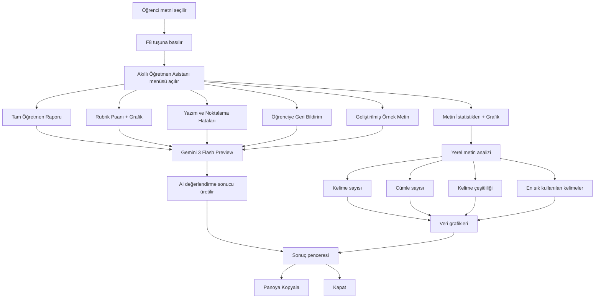

# Akıllı Öğretmen Asistanı

## Proje Fikri

Bu proje, öğretmenlerin öğrenci kompozisyonlarını daha hızlı, tutarlı ve veriye dayalı biçimde değerlendirebilmesi için geliştirilmiş bir masaüstü yardımcı aracıdır.

Kullanıcı herhangi bir uygulamada öğrenci metnini seçer, `F8` tuşuna basar ve açılan menüden değerlendirme işlemini seçer. Uygulama seçili metni Ollama üzerinden Gemini 3 Flash Preview modeline gönderir, öğretmen odaklı analiz üretir ve bazı sonuçları grafiklerle görselleştirir.

## Hedef Meslek Grubu

- Türkçe öğretmenleri
- Türk Dili ve Edebiyatı öğretmenleri
- Yazma becerisi dersi veren eğitmenler
- Kompozisyon/ödev değerlendiren akademisyenler

## Veri Görselleştirme Yaklaşımı

Proje, öğrenci yazısını metinsel veri olarak ele alır ve iki farklı veri katmanı üretir:

1. AI destekli rubrik puanları
   - Dil bilgisi
   - Yazım ve noktalama
   - Konu bütünlüğü
   - Anlatım açıklığı
   - Yaratıcılık
   - Kelime çeşitliliği


2. Yerel metin istatistikleri
   - Kelime sayısı
   - Cümle sayısı
   - Paragraf sayısı
   - Benzersiz kelime sayısı
   - Kelime çeşitliliği oranı
   - Ortalama cümle uzunluğu
   - Uzun cümle sayısı
   - Geçiş ifadesi sayısı
   - En sık kullanılan anlamlı kelimeler

Bu veriler uygulama içinde yatay bar grafiklerle gösterilir.

## Özellikler

- `🧑‍🏫 Tam Öğretmen Raporu`
- `📌 Metin İstatistikleri + Grafik`
- `📊 Rubrik Puanı + Grafik`
- `✍️ Yazım ve Noktalama Hataları`
- `💬 Öğrenciye Geri Bildirim Yaz`
- `📝 Geliştirilmiş Örnek Metin`

## Kullanılan Teknolojiler

- Python
- Tkinter
- Ollama
- Gemini 3 Flash Preview
- pynput
- pyautogui
- pyperclip

## Mac Kurulum

Proje klasöründe Terminal açın:

```bash
cd "/Users/yusuferkamaruntas/Downloads/Introduction-to-Data-Visualization-Project-Assignment-main"
```

Sanal ortam oluşturun:

```bash
python3 -m venv .venv
```

Sanal ortamı aktif edin:

```bash
source .venv/bin/activate
```

Paketleri kurun:

```bash
python -m pip install --upgrade pip
pip install -r requirements.txt
```

Ollama üzerinden Gemini 3 Flash Preview modelini çalıştırın:

```bash
ollama run gemini-3-flash-preview
```

Ollama hesabı bağlantısı istenirse tarayıcıda açılan bağlantıdan cihazı onaylayın.

Uygulamayı başlatın:

```bash
python main.pyw
```

Alternatif olarak Mac için hazırlanan başlatma dosyasını kullanabilirsiniz:

```bash
./BASLAT_MAC.command
```

## Mac İzinleri

F8 kısayolu ve seçili metni kopyalama özelliği için macOS izinleri gerekebilir.

System Settings > Privacy & Security bölümünden şu izinleri açın:

- Accessibility
- Input Monitoring

Bu izinlerde `Terminal`, `Python` veya `Python Launcher` görürseniz aktif hale getirin.

## Kullanım

1. TextEdit, Word, tarayıcı veya başka bir uygulamada öğrenci yazısını seçin.
2. `F8` tuşuna basın.
3. Açılan menüden işlem seçin.
4. Sonuç ayrı pencerede görüntülenir.
5. Rubrik veya metin istatistiği işlemlerinde grafikler de gösterilir.

Mac klavyede F8 medya tuşu gibi davranırsa `fn + F8` kullanın.

## Model Önceliği

Uygulama önce Gemini 3 Flash Preview modelini kullanır. Bağlantı veya yetki sorunu olursa yerel yedek modellere düşer.

Model sırası:

1. `gemini-3-flash-preview:latest`
2. `gemini-3-flash-preview:cloud`
3. `gemini-3-flash-preview`
4. `gemma3:4b`
5. `gemma3:1b`

## Proje Sunum Cümlesi

Bu projede öğretmenlerin öğrenci kompozisyonlarını değerlendirme sürecini destekleyen AI tabanlı bir veri görselleştirme aracı geliştirilmiştir. Uygulama seçili öğrenci metnini rubrik kriterlerine göre değerlendirir, metinden ölçülebilir istatistikler çıkarır ve bu sonuçları grafiklerle sunar.



